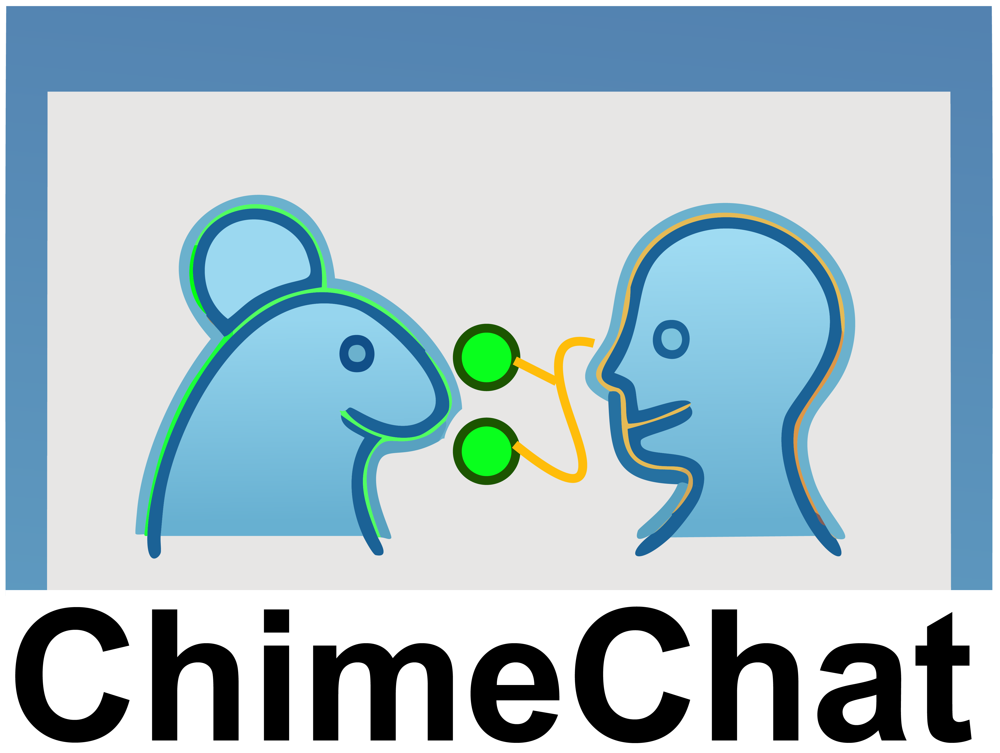
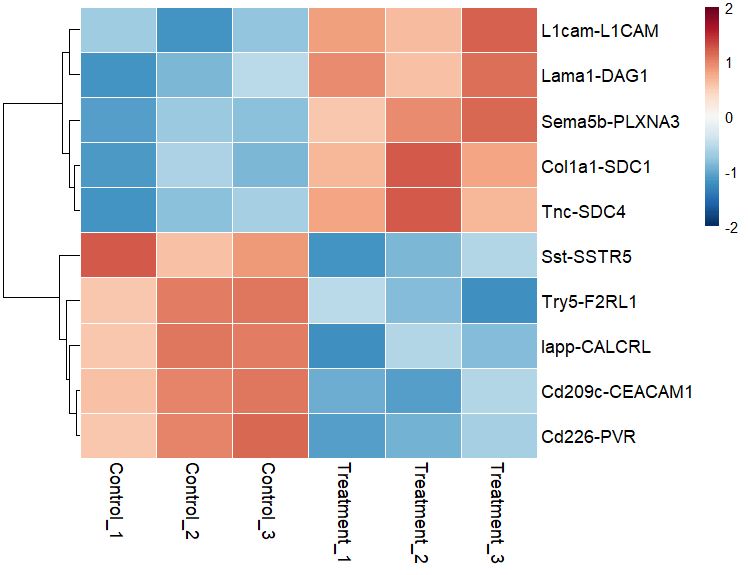
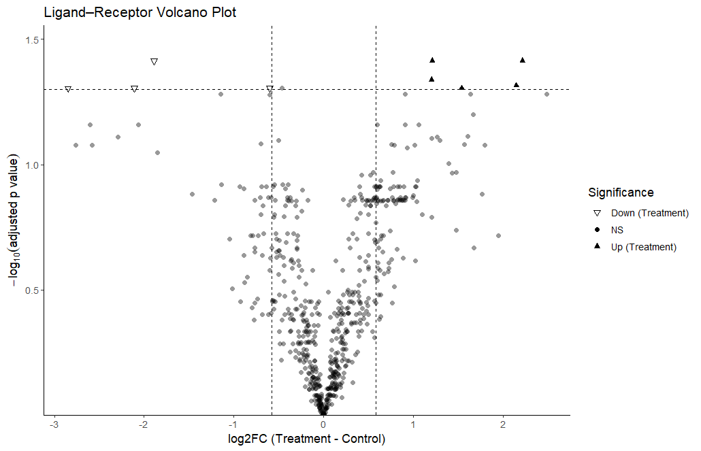

<!-- README.md is generated from README.Rmd. Please edit that file -->

# ChimeChat 

## Cross-species ligand–receptor analysis pipeline for paired human–mouse bulk RNA-seq data.

# Overview

ChimeChat is an R package that streamlines cross-species ligand–receptor
(L–R) analysis when you have paired human and mouse bulk RNA-seq
datasets. It automates:

1.  Mapping mouse genes to human orthologs

2.  VST transformation of human and mouse raw counts (via DESeq2)

3.  Merging both species into a unified gene expression matrix

4.  Ligand–receptor scoring

5.  Statistical testing

6.  Heatmap visualization of L–R pairs

# Installation

## 1. Install dependencies

``` r
install.packages("BiocManager")
BiocManager::install(c("DESeq2", "biomaRt", "SummarizedExperiment"))
install.packages(c("dplyr", "tibble", "tidyr", "readxl", "pheatmap", "RColorBrewer"))
remotes::install_github("sqjin/CellChat")
```

## 2. Install ChimeChat from GitHub

``` r
install.packages("remotes")
remotes::install_github("m03077yhtnt/ChimeChat")
```

# Example

``` r
library(ChimeChat)

# Step 1: Merge and VST
ChimeData <- run_ChimeDB(
  human_file = "Human_CountData.xlsx",
  mouse_file = "Mouse_CountData.xlsx"
)

# Step 2: LR scores
LR_scores <- get_ChimeLRscore(
  combined        = ChimeData$combined,
  direction       = "mouse_ligand_human_receptor",
  db_scope        = c("secreted","contact","ecm"),
  rename_to_mouse = TRUE,
  ortholog_map    = ChimeData$ortholog_map
)

# Step 3: Statistics
stat_results <- get_ChimeStatistics(LR_scores)

# Step 4: Heatmap
run_ChimeHeatmap(LR_scores, stat_results, n_top = 20)
```

<div style="display: flex; justify-content: center;">




</div>

# License

## MIT © Yu Hatano
